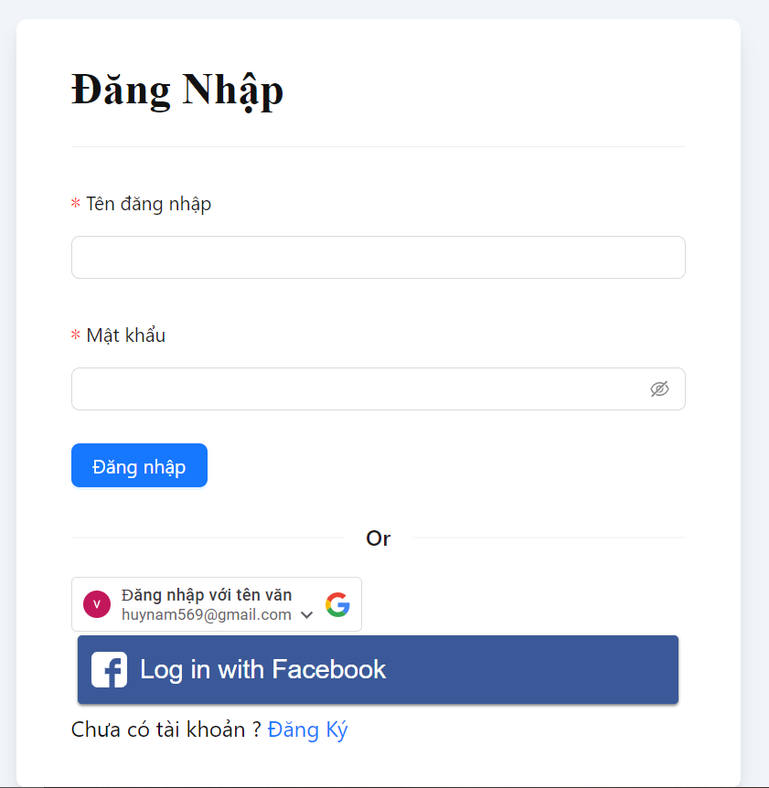
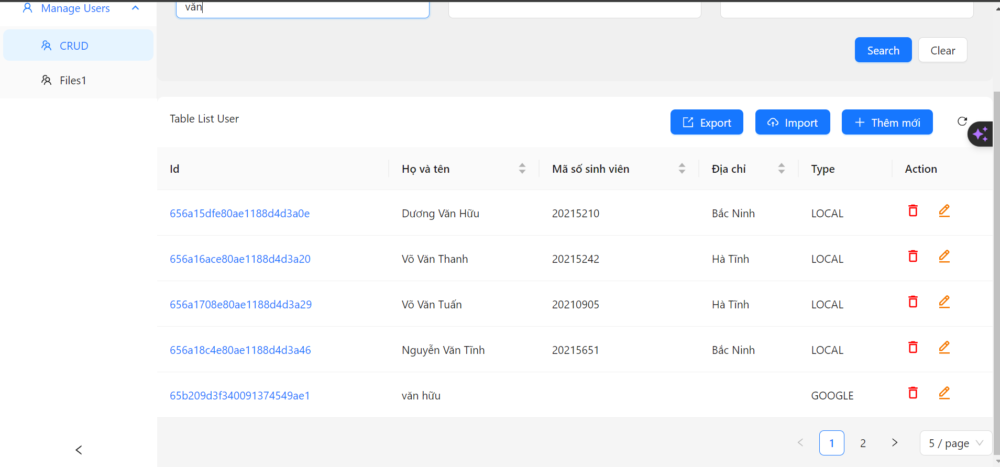
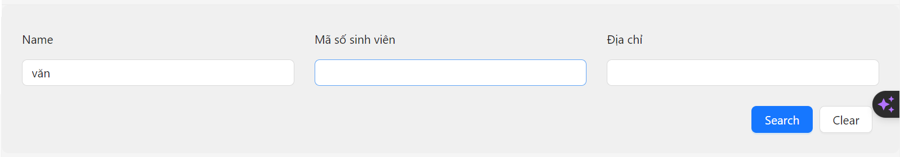
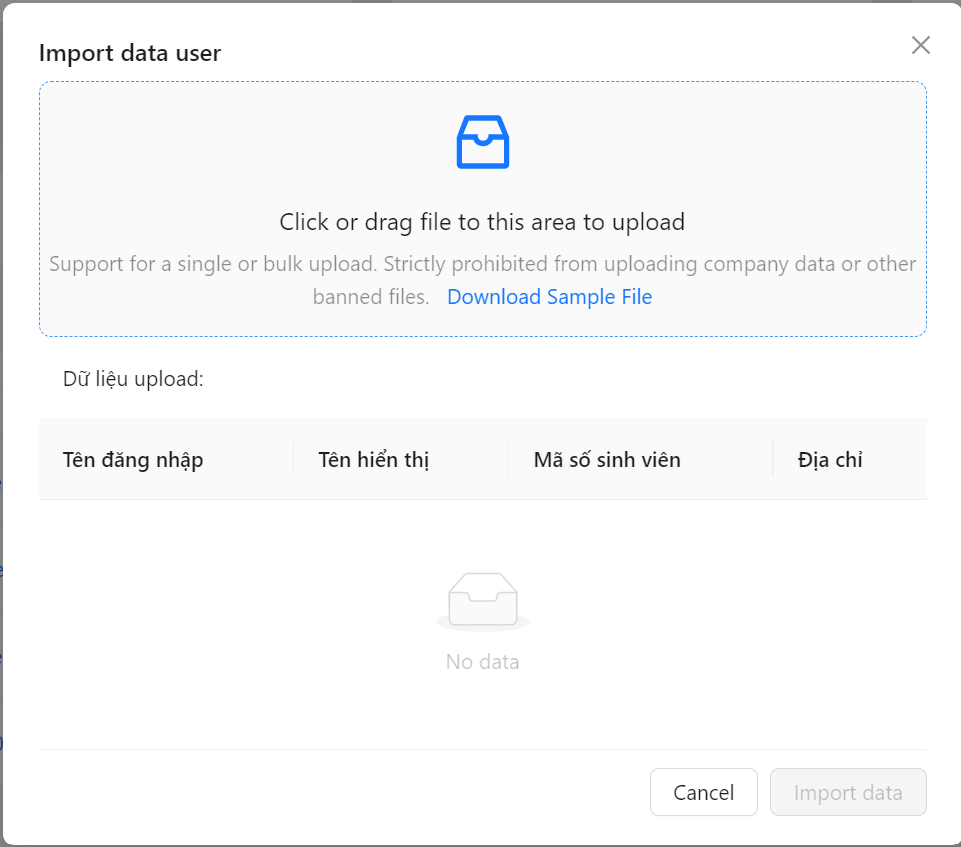
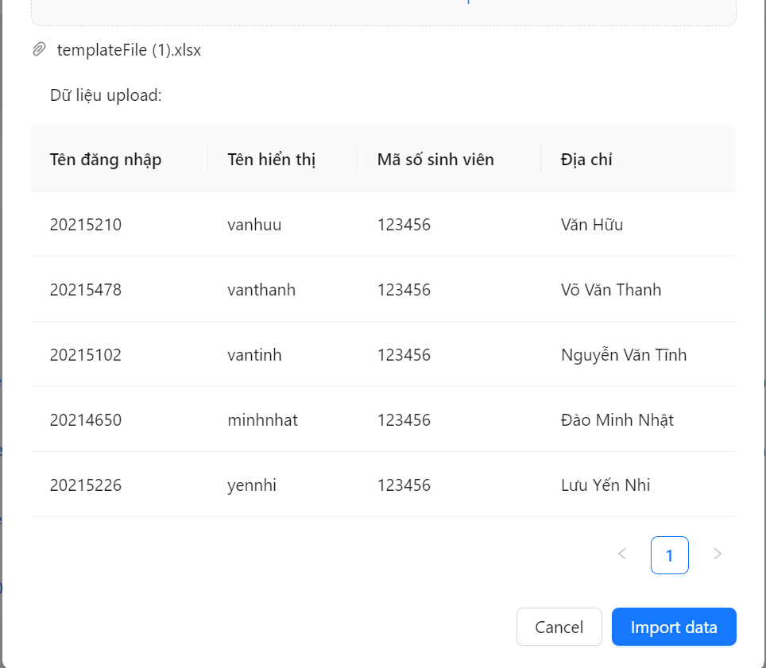

**_ Account management | Văn Hữu _**

React 18
React Router 6
Redux Tookit
Vite 4

Các bước cần làm để chạy dự án

1. Clone Repository: Clone repository về máy cục bộ của bạn bằng cách chạy lệnh sau trong terminal:
   git clone git@github.com:vanhuu1904/Account_management_gr1_fe.git
2. Cài đặt dependencies: Di chuyển vào thư mục chính của dự án và cài đặt các phụ thuộc bằng npm:
   cd Account_management_gr1_fe
   npm install
3. Khởi chạy ứng dụng: Chạy lệnh sau để bắt đầu máy chủ phát triển:
   npm run dev
4. Truy cập ứng dụng: Mở trình duyệt web và truy cập vào địa chỉ
   http://localhost:3000 để xem ứng dụng của bạn.
   Đồ án 1 Web
   Trang web demo: https://account-management-gr1.vercel.app/login
   Chức năng Cơ bản:
   Đăng nhập bằng tài khoản local, google
   Thêm sửa xóa tài khoản

Trang login

Quản Lý tài khoản

Tìm kiếm tài khoản

Thêm mới tài khoản bằng file excel

